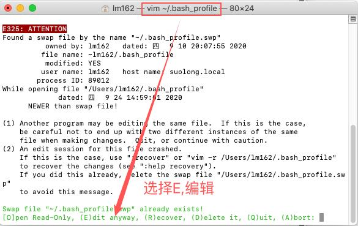
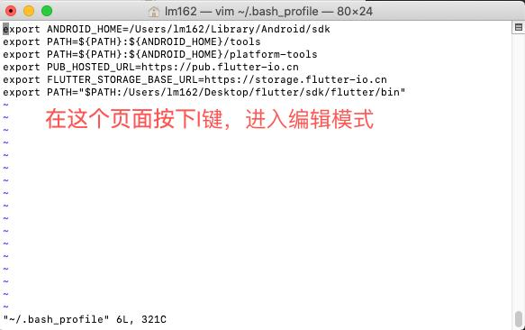
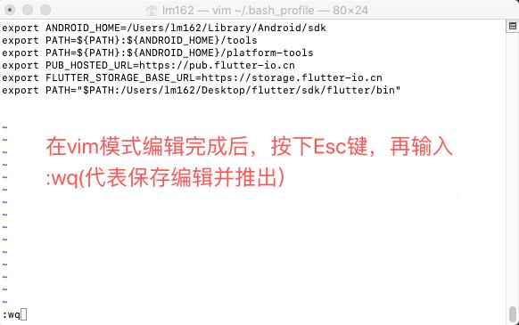
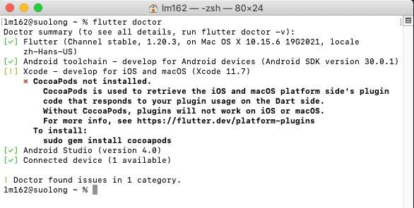

## 										Flutter简介与环境配置

### 一、Flutter简介

​		Flutter 是 Google推出并开源的移动应用开发框架，主打跨平台、高保真、高性能。开发者可以通过 Dart语言开发 App，一套代码同时运行在 iOS 和 Android平台。 Flutter提供了丰富的组件、接口，开发者可以很快地为 Flutter添加 native扩展。同时 Flutter还使用 Native引擎渲染视图，这无疑能为用户提供良好的体验。


### 二、使用场景

​	跨端开发：针对原生开发面临问题，人们一直都在努力寻找好的解决方案，而时至今日，已经有很多跨平台框架(指Android和iOS两个平台)，根据其原理，主要分为三类：

- H5+原生（Cordova、Ionic、微信小程序）
- JavaScript开发+原生渲染 （React Native、Weex、快应用）
- 自绘UI+原生(QT for mobile、Flutter)


## 三、方案的优劣势

| 技术类型            | UI渲染方式      | 性能 | 开发效率        | 动态化     | 框架代表       |
| ------------------- | --------------- | ---- | --------------- | ---------- | -------------- |
| H5+原生             | WebView渲染     | 一般 | 高              | 支持       | Cordova、Ionic |
| JavaScript+原生渲染 | 原生控件渲染    | 好   | 中              | 支持       | RN、Weex       |
| 自绘UI+原生         | 调用系统API渲染 | 好   | Flutter高, QT低 | 默认不支持 | QT、Flutter    |


## 四、环境配置

配置flutter环境变量（官网地址：https://flutter.cn/docs/development/tools/sdk/releases?tab=macos）

以Mac系统为例： Flutter 依赖下面这些命令行工具（bash、mkdir、rm、git、curl、unzip、which）

1. ##### 解压Flutter SDK安装包到你想安装的目录，打开终端(可由文件 -> 前往 -> 实用工具 -> 终端)如：

   ```shell
   cd ~/development
   unzip ~/Downloads/flutter_macos_v0.5.1-beta.zip
   ```

2. ##### 配置Flutter全局环境变量

   创建.bash_profile文件

   打开.bash_profile文件

   编辑.bash_profile文件

   保存.bash_profile文件

   验证flutter环境变量是否在.bash_profile文件中

   ```shell
   touch ~/.bash_profile  
   open ~/.bash_profile
   vim ~/.bash_profile
   source ~/.bash_profile  
   echo $PATH
   ```

   其中vim ~/.bash_profile时，有可能会出现以下情况

   

   进入vim模式后，需要按一下I键，然后在.bash_profile文件中配置以下信息

   

   export PUB_HOSTED_URL=https://pub.flutter-io.cn
   export FLUTTER_STORAGE_BASE_URL=https://storage.flutter-io.cn
   export PATH="$PATH:/Users/lm162/Desktop/flutter/sdk/flutter/bin"

   将最后一行的PATH中的/Users/lm162/Desktop/flutter/sdk替换为自己的Flutter Sdk目录

   最后按下Esc(退出编辑模式)，:wq(保存文件并退出)，保险起见，可以再输入一下source ~/.bash_profile  就OK了

   

3. ##### 运行 flutter doctor命令

   配置好flutter的全局环境变量后，就可以在任意的终端窗口执行flutter的相关命令，例如：

   ```shell
   flutter doctor
   ```

   如果环境配置没有问题，可以看到如下现象，有问题的话，请检查前面2个步骤是否存在遗漏点

   

4. ##### 安装Android Studio

   由于Android Studio对Flutter开发支持力度非常大，所以是最佳的开发工具，其他的像Vs Code，Xcode也是可以的。这里就不再赘述Android Studio的安装教程了

   Android Studio安装参考链接 ：https://www.runoob.com/android/android-studio-install.html

5. ##### 安装Flutter和Dart插件

   - `Flutter`插件： 支持Flutter开发工作流 (运行、调试、热重载等)。
   - `Dart`插件： 提供代码分析 (输入代码时进行验证、代码补全等)。
   - 安装步骤：
     1. 启动Android Studio。
     2. 打开插件首选项 (macOS：**Preferences>Plugins**, Windows：**File>Settings>Plugins**)。
     3. 选择 **Browse repositories…**，选择 flutter 插件并点击 `install`。
     4. 重启Android Studio后插件生效。

6. ##### 创建Flutter应用

   1. 选择 **File>New Flutter Project** 。
   2. 选择 **Flutter application** 作为 project 类型, 然后点击 Next。
   3. 输入项目名称 (如 `myapp`)，然后点击 Next。
   4. 点击 **Finish**。
   5. 等待Android Studio安装SDK并创建项目。

​	

